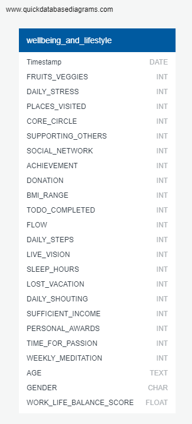

## FINAL PROJECT 
presentation date: February 8th, 2023

##### U of T Data Analytics Boot Camp
#### INSTRUCTOR: Hassan Ahmad
#### ASSISTANT INSTRUCTOR: Ankush Malhotra

## GROUP 5:
- Josette Bitanga
- Crystina Dang
- Henrietta Danso
- Isobel Tsang

## PROJECT DETAILS
### THEME: Human Behaviour
### TOPIC: Work Life Balance
#### QUESTION: Can the Work Life Balance score be predicted using a reduced number of questions?

### DATASET: Lifestyle_and_wellbeing_data_Kaggle.csv - [Dataset](data/staging_table.csv)
#### DESCRIPTION: 
Provided from [Kaggle](https://www.kaggle.com/datasets/ydalat/lifestyle-and-wellbeing-data):
This dataset contains the survey responses from www.Authentic-Happiness.com.
There are 24 attributes describing how we live our lives, including a calculated field, the Work_Life_Balance_Score.

The Work-Life Balance survey evaluates how we thrive in both your professional and personal lives: it reflects how well you shape your lifestyle, habits and behaviors to maximize your overall life satisfaction along the following five dimensions:

Healthy body, reflecting your fitness and healthy habits;
Healthy mind, indicating how well you embrace positive emotions;
Expertise, measuring the ability to grow your expertise and achieve something unique;
Connection, assessing the strength of your social network and your inclination to discover the world;
Meaning, evaluating your compassion, generosity and how much 'you are living the life of your dream'.

An [initial ERD](images/initial_wellbeing_and_lifestyle_ERD.png) was sketched out showing the 5 tables described above. However, as the project progressed, it was decided that these tables were no longer needed and a simpler diagram to provide the data types was provided shown below.

#### REASONING: 
We are interested in exploring the influence of the various social, mental, work, and spiritual factors on work/life balance. The dataset found provides insight on a vast range of these external factors. As we are looking into predicting the good or bad work/life balance based on known parameters, this will be a classification problem using a supervised learning model. In the real world, this could be a potentially valuable tool for a given company's Human Resources efforts, especially to help strengthen employee wellbeing, staff retention, and improve company culture as a whole. In this scenario, we would be focusing on maximizing the precision of the model to catch all possible "bad" work/life balance scores. This would ensure that all employees that may require any support can receive the help they need.

#### DATASET NOTES:
- Bad data in daily_stress column found: "1/1/00", data type set to VARCHAR upon upload, needs to be changed to INT
- It was noted that most people taking the quiz were above 20 year old.
- The gender column will be dropped as it is irrelevant to the output.
- For the timestamp column, we removed the time and converted the date from string to date data type. This will be used to visualize the data over time, but will not be used for the machine learning model.
- Visually investigating the potential relationships between the different features and the work/life balance score, Flow and Live_Vision seem to contribute the strongest. 
- There were 15971 total respondents. Of the total, 3786 scored excellent (above 700) and 12185 scored 700 or below (for our purposes, will be categorized as "needs_improvement").
- Data exploration was completed on Google Colaboratory using Pyspark, [ETL.ipynb](notebooks/ETL.ipynb), and data was uploaded to a database on AWS and Postgres.
- The initial raw data inserted into a database on Postgres can be found in [staging_table.csv](data/staging_table.csv) called "STG_WL". The cleansed data can be found in [transformed_table.csv](data/transformed_table.csv) called "TRF_WL".
- An [initial sketch of the dashboard](dashboard/Dashboard_MockUp_ROUGH.pptx) is available to be viewed.
- An imbalance has been noted in the output data. A resampling technique might need to be selected.
- The output selected (Work/Life Balance Score) is entirely numerical. Therefore, it will be scaled and bucketed. Encoding will not be required.

### FINAL PRESENATION:
[Link to slide deck](slide_deck/final-project-presentation.pptx)

#### DASHBOARD:
[Link to dashboard](https://public.tableau.com/app/profile/henrietta.danso/viz/WellbeingandHappiness/FinalDashboard)

## MACHINE LEARNING MODELS:

**Factors**:
- Inputs: Flow and Live_Vision
- Output: Work/Life Balance score
- Classification, binary output, higher precision
- 4 models chosen for testing: Logistic Regression, Balanced Random Forest Classifer, Decision Tree, XGBoost 

1. **Logistic Regression** - [Output_LogisticRegression.ipynb](notebooks/Output_LogisticRegression.ipynb)

FINDINGS:
- FULL SET: accuracy score of 95%, precision avg 93%
- Not feature importance compatible
- Only flow and live_vision according to high variance and low mean: accuracy score of 80%, precision avg 74%

2. **Balanced Random Forest Classifier** - [Output_BRF_Boost.ipynb](notebooks/Output_BRF_Boost.ipynb)

FINDINGS: 
- FULL SET: accuracy score of 94% - considering this is for a low-risk outcome, it is a high percentage, precision avg 94%
- 7 of 19 features removed according to feature importance: accuracy score of 90%, not a significant reduction, precision avg 91%
- 11 of 19 features removed according to feature importance: accuracy score of 86%, precision avg 88%
- Only flow and live_vision according to high variance and low mean: accuracy score of 73%, still quite high for 2 of 19, precision avg 79%
- Only supporting_others and achievements according to top feature importance: accuracy score of 76%, precision avg 82%

3. **Decision Tree** - [Output_decisionTree.ipynb](notebooks/Output_decisionTree.ipynb)

FINDINGS:
- FULL SET: accuracy score of 86%, precision avg 87%
- Not feature importance compatible
- Only flow and live_vision to high variance and low mean: accuracy score of 80%, precision avg 78%

4. **XGBoost** - [Output_BRF_Boost.ipynb](notebooks/Output_BRF_Boost.ipynb)

FINDINGS:
- FULL SET: accuracy 91%, precision avg 94%
- 7 of 19 features removed according to feature importance: accuracy score of 87%, not a significant reduction, precision avg 91%
- 11 of 19 features removed according to feature importance: accuracy score of 82%, precision avg 88%
- Only flow and live_vision according to high variance and low mean: accuracy score of 62%, precision avg 77%
- Only supporting_others and sufficient_income according to top feature importance: accuracy score of 70%, precision avg 79%

### MODEL SUMMARY:
Logistic Regression provided the best outcome with minimal inputs without top features provided, with further investigation, there is a chance a better pairing could be discovered

## MEETING DATES, README UPDATE AT START AND END:
1. Jan 16: Topic and dataset decided, as well as back up dataset, all team members to create 3 questions and preprocess data, RDS and S3 bucket created

Tips from Ankush:
- Use AWS to create Cloud
- think of what machine learning model would be best
- Use PostGres
- Create draft ERD
- Show testing KPI
- Consider pre-machining learning page for dashboard

2. Jan 18: Main question selected, database created and shared, binning columns as group, divided deliverables

3. Jan 23: Main question revised, ERD reduced to original table, further data exploration

Tips from Hassan:
- consider what variable most affects the final score
- reduce tables
- consider ML outcome using limited parameters

4. Jan 26: ML models described, database renamed, Segment 1 complete

5. Jan 30: Review progress, divide models to test, assign presenter, and start slide deck

6. Feb 1: Continuation of model testing and presentation refinement

7. Feb 6: Model testing complete, file clean up and presentation refinement
